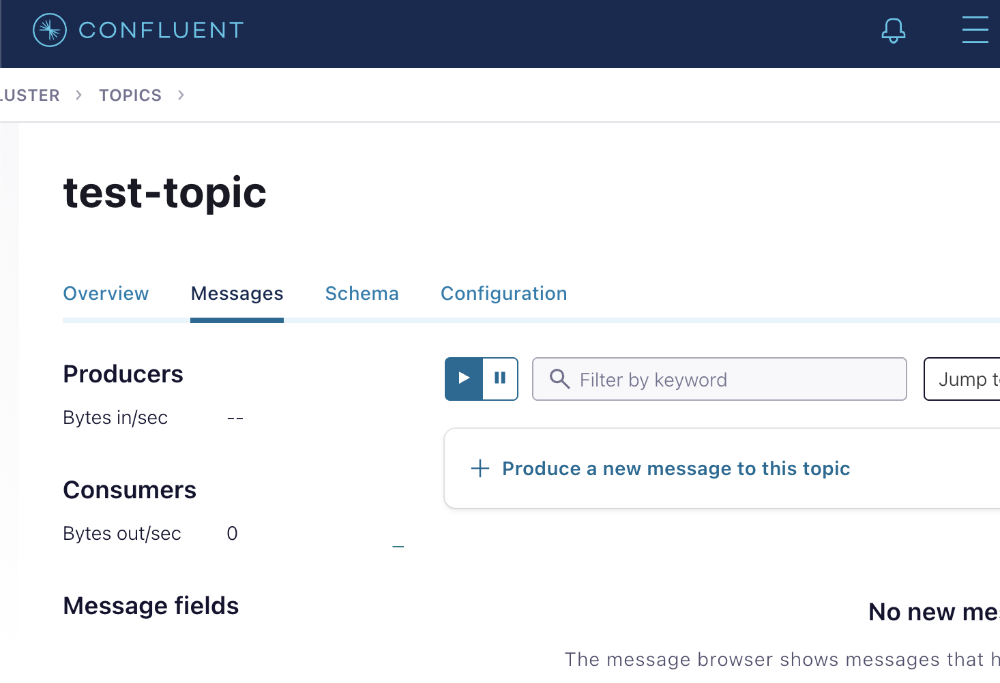

# kafka 기초

강의에서는 vm을 이용하지만, docker compose를 이용해서 confluent kafka를 이용할 것임...(설치가 번거로움)

Topic 안에 여러 partition 존재.

메시지가 순차적으로 물리적인 파일에 write 됨.

데이터 별로 offset 정보를 가지고 있음.

빠른 이유가 **순차적** 으로 물리적인 파일에 쓰기 때문인 것으로 알고 있음(random 이 아님)

### parition
partition이 kafka의 병렬 및 가용성의 핵심 요소

partition에 데이터가 분산 저장이 될 수 있음. partition 내에서만 정렬이 됨.

카프카 클러스터 안에 여러 브로커들이 있을 수 있음.

병렬 성능과 가용성을 위해 다른 브로커들에 파티션들이 할당된다고 함.
-> learder들은 다른 브로커에 할당되는 것으로 보임.

kafka-logs의 {topic} 폴더에 로그들이 있음.

### consumer, producer

producer는 전략적으로 어떤 파티션에 데이터를 보낼 지 결정함.
(sticky / rr, batch size / linger.ms 을 말하는 것 같음.)

`ProducerRecord`에는 Topic(필수), partition, key, value(필수), header 값이 있음

`consumer` 가 데이터를 가져가도 실제 데이터는 삭제되지 않음.

consumer 설정이 복잡하다고 함.

broker에 데이터 보내기 전에, 객체를 직렬화 진행함.

topic은 설정 했지만, 어느 파티션으로 가야할 지 결정해야 함.
-> partitioner

 

> ProducerRecord -> send() -> Serializer -> Partitioner -> topic partition

 

#### Serializer

producer - consuemr 간의 Serialized Message만 보낼 수 있음.

key - value를 Serializer를 통해 byte[] 로 변경 후, 전송 -> 네트워크 대역폭 절약 가능!

`Consuemr`는 이를 `Deserializer`를 통해 역직렬화 함.
(spring kafka에 이런 Serilizer를 지정해주는 것이 있음. 아마 이 부분 때문으로 보임. redis, db도 있긴 함.)

**key 값을 가지지 않는 메시지 전송**

`partitioner`는 `broker`로 부터 메타 데이터를 받음.
-> sticky, round robin 전략이 있음.

topic이 여러 개 파티션을 가졌으면, 전송 순서 보장되지 않음
-> 전송 순서 보장하려면, partition 1개만 설정해야 함.

partition 별로 batch가 있음 -> 데이터를 모아서 한 번에 보냄.

분산 시스템에서 전송 순서를 보장하게 될 경우, 속도 저하 문제가 생길 수 있음.

batch 사이즈 만큼 차면 바로 보냄. 만약 다 차지 않았으면, linger.ms 값을 보고 전송함.

round robin(RR) : 유명함. 균일하게 넣는 것. 1,2,3,1,2,3,..... 2.4이전 버전 기본 설정임. 메시지 배치를 순차적으로 다른 파티션으로 전송함. 

sticky : 2.4 버전부터 기본 설정. RR보다 성능을 개선시킴. 하나의 배치에 메시지를 먼저 채움. 다 채워지면, 다른 배치를 채움. 배치를 채우지 않고 전송을 하면, 네트워크 오버헤드가 발생함. 이를 개선하기 위한 전략임.

**key 값을 가지면?**

특정 파티션으로 고정되어 전송됨. key를 해싱해서 partition 분배

#### Consumer Group

1 개의 consumer group 내에 consumer가 한 개라면, 모든 partition의 메시지를 가져옴. 보통 partition : conusmer = 1 : 1 로 설정(분산 처리를 위해)

`consumer`는 `partition assign` 전략이 있음.

consuemr group 내에 consumer 변화가 있으면, `Rebalancing`이 일어남.

만약 partition의 개수보다 conusmer의 개수가 더 많아지면, 노는 consumer가 생기기 됨.

consumer group 내에서만 offset이 공유 됨. 서로 독립적임.
-> 각각 group.id 를 가지고 있음.

consumer가 추가되면, rebalancing이 일어남.

consumer가 다 사라지더라도, consumer group은 바로 사라지지 않음. (일정 기간 후에, 더 이상 할당 안되면 삭제됨.)

## 느낀점

23년 1월에 인턴을 하면서 알게 된 내용들이 대부분임.

partitioner, key, partition 순서, linger.ms, consumer group

복습하는 느낌으로 강의를 봤음.

궁금한 점은 vm으로 kafka 를 설치하도록 한 점이 궁금함. docker를 통해 파일만 공유하면 모든 수강생들이 손쉽게 설치할 수 있을 것 같았음.

그래서 docker를 이용하여 실습을 따라가보자고 함

이를 이용해서 실습을 따라가 볼 예정임.
